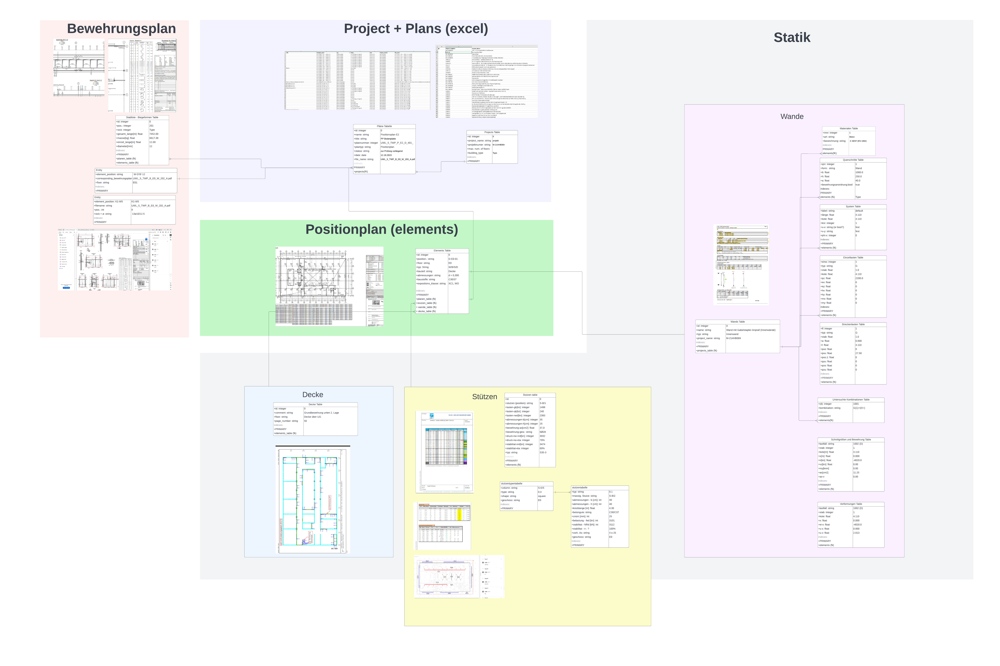

# PDF Data Extraction and Database Insertion Tool
This Python script automates the extraction of data from PDF files and inserts the parsed data into a database. The script supports multiple scraping modules, each designed to extract specific information from different types of PDF documents. The extracted data is then inserted into a database using SQLAlchemy.
This code is part of a larger project that uses physics-informed neural networks to optimize the structural design elements of buildings. Our goal is to train the model on data from buildings that have already been constructed to achieve reliable predictions. Therefore, the parsers extract diffrent data  from building elements designed by an engineering company.
 
## Research Context
 
This tool was developed as part of a larger academic research project at the **Institut für Statik und Dynamik, Technische Universität Braunschweig**, titled:
 
> *"Physics- and data-driven modeling for integrated computation and design of structures with optimized material efficiency in early design stages"*
 
The project's central goal is to help structural engineers make better design decisions earlier in the planning process, when information is still limited but the cost of mistakes is highest. It does this by combining real-world engineering data with physics-informed neural networks (PINNs) to build surrogate models that can predict structural behavior and suggest optimized component designs, without having to run expensive simulations from scratch each time.
 
The overall pipeline, referred to as the **Hybrid Modeling Method (HyMoDe)**, works roughly as follows: data from already-constructed buildings is collected and used to train generalized structural surrogate models. These surrogates are then used iteratively to evaluate design configurations and converge on optimized components that meet engineering standards. The physics-informed aspect means the neural networks are not just learning from data alone, but are also constrained by the underlying differential equations that govern structural mechanics, making predictions more reliable even with limited training data.
 
**This repository covers the first stage of that pipeline.** The work here focused on the ETL (Extract, Transform, Load) process: parsing raw engineering documents (structural calculation PDFs, reinforcement plans, position plans, and Excel-based project sheets) and loading the structured data into a relational database. This database then serves as the data source for the downstream machine learning models.
 
[View the research poster here.](https://media.licdn.com/dms/image/v2/D4D22AQFjahZXEt7sXA/feedshare-shrink_1280/feedshare-shrink_1280/0/1720788798917?e=1776297600&v=beta&t=Z0zKeKgpymdvWNyKZpbkztSiKBoSnU-VQwy0zc5LoMc)
 
## Features
- **Automated PDF Processing**: The script processes all PDF files in a specified directory.
- **Modular Scraping**: Different scraping modules are used depending on the type of PDF.
- **Database Integration**: Parsed data is inserted into a local or Azure SQL database.
- **Error Logging**: All operations and errors are logged into a log file (`output_log.txt`).
## Prerequisites
- Python 3.x
- The following Python libraries:
  - `logging`
  - `tkinter`
  - `sqlalchemy`
  - `pandas`
  - `pyodbc`
- Environment variables:
  - `PDF_FOLDER_PATH`: Path to the folder containing the PDF files.
  - `LOCAL_DB_CONNECTION_STRING`: Connection string for the local database.
  - `AZURE_DB_CONNECTION_STRING`: Connection string for the Azure SQL Server.
## Installation
1. **Clone the repository**:
   ```bash
   git clone <repository_url>
   cd <repository_directory>
   ```
2. **Install the required Python packages**:
   ```bash
   pip install -r requirements.txt
   ```
3. **Set the necessary environment variables**:
   You can set the environment variables in your shell or include them in a `.env` file.
   ```bash
   export PDF_FOLDER_PATH='/path/to/your/pdf/folder'
   export LOCAL_DB_CONNECTION_STRING='your_local_db_connection_string'
   export AZURE_DB_CONNECTION_STRING='your_azure_db_connection_string'
   ```
## Usage
1. **Modify the parser selection**:
   By default, the script uses the `statik_columns_scraping_3_2` module for scraping. If you want to use a different module, change the `parser` variable in the `__main__` section.
   ```python
   parser = c2_scraping  # Change this to another module if needed
   ```
2. **Run the script**:
   Execute the script using Python:
   ```bash
   python script_name.py
   ```
3. **Check the logs**:
   The script generates a log file (`output_log.txt`) in the working directory, where you can review the processing results and any errors encountered.
## Customization
- **Adding new scraping modules**:
  If you have other types of PDFs to process, you can create new scraping modules and integrate them into the script. Simply import the new module and update the `parser` variable to use it.
- **Database Table Naming**:
  Ensure that your scraping module includes a `tableName` attribute in the DataFrame to specify the destination table in the database.
## Troubleshooting
- **Empty DataFrames**:
  If the DataFrame is empty after processing a PDF, the script will skip the insertion and log a message in the log file.
- **Database Connection Issues**:
  If there are errors during the database insertion, check the connection string and ensure that the database is accessible.
## Database
- **Database design**:
  I've included my database design diagram in PDF format to the repository.
 
## Database Design Diagram
 
The diagram below illustrates the full database schema used in this project. It covers the relationships between all major tables, grouped by document source type: **Bewehrungsplan**, **Project + Plans (excel)**, **Positionplan (elements)**, **Statik**, **Decke**, and **Stützen**.
 

 
*Figure 1: Entity-relationship overview of the database schema, showing all tables and their foreign key relationships across the different PDF source types.*
